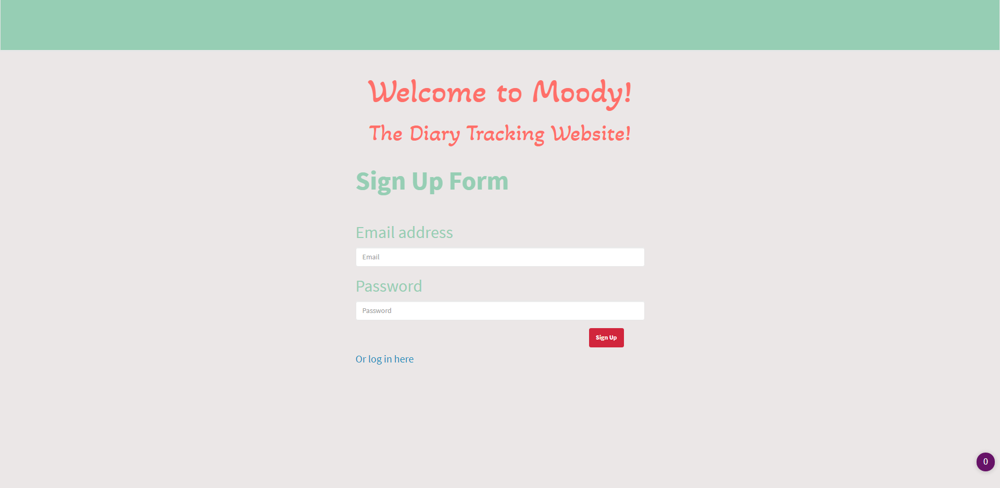
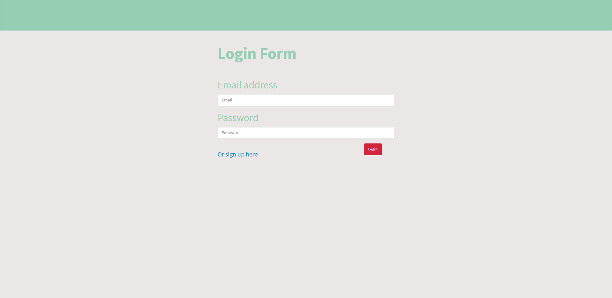
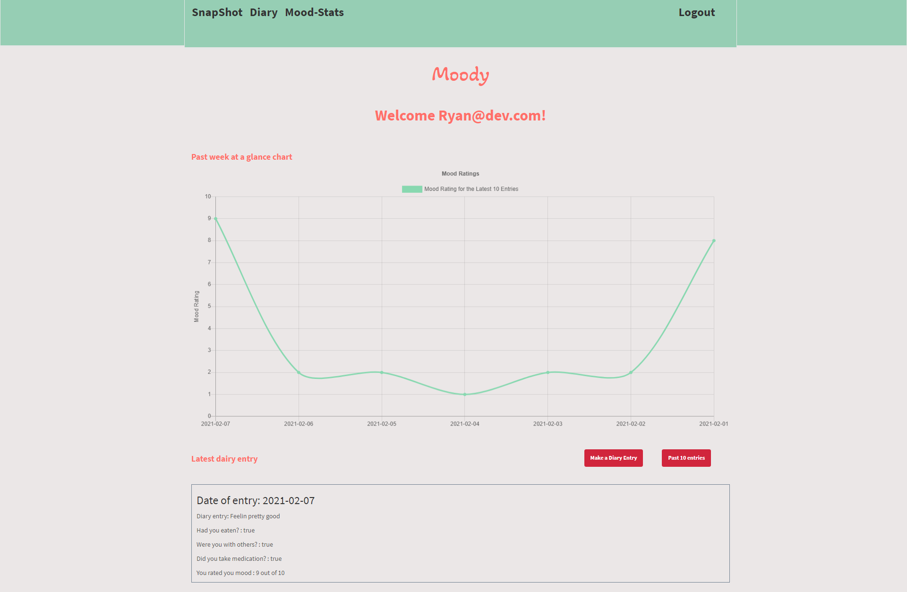
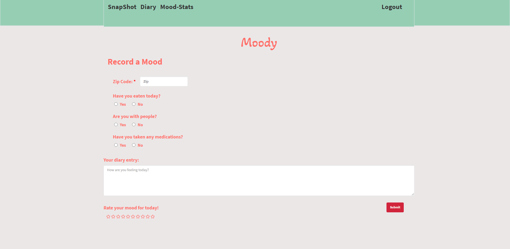
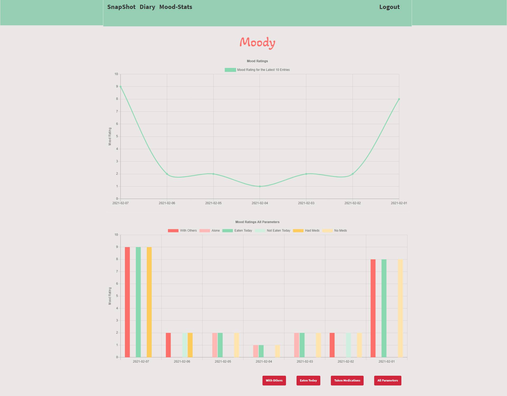

# Sequelize - Reverse Engineering Code

## Description 

The purpose of this project is to create a full stack application that makes use of a MySQL database, Handlebars npm

You can find the repo on [GitHub](https://github.com/Rconat/Mood-Tracker-App-Project-2).

The project is deployed on [Heroku](https://calm-castle-04071.herokuapp.com/)

---

---

## Table of Contents

* [List of Files](#List-of-Files)
* [Explanation of Code](#Explanation-of-Code)
    * [MySQL Database and Sequelize](#MySQL-Database-and-Sequelize)
    * [Path NPM](#Path-NPM)
    * [Express NPM](#Express-NPM)
    * [Passport Authentication](#Passport-Authentication)
    * [Password Hashing](#Password-Hashing)
    * [JavaScript Libraries](#JavaScript-Libraries)
    * [Public Files](#Public-Files)
    * [Weather icon](#Weather-Icon)
    * [Public Interaction](#Public-Interation)
    * [Usage](#usage)
* [Credits](#credits)

 

## List of Files

<ul>
    <li>README.md</li>
    <li>server.js</li>
    <li>package.json</li>
    <li>package-lock.json</li>
    <li>.gitignore</li>
    <li>.eslintignore</li>
    <li>.eslintrc.json</li>
    <li>.travis.yml</li>
    <li>main.handlebars</li>
    <li>diary.handlebars</li>
    <li>graphs.handlebars</li>
    <li>login.handlebars</li>
    <li>members.handlebars</li>
    <li>api-routes.js</li>
    <li>html-routes.js</li>
    <li>reset.css</li>
    <li>style.css</li>
    <li>diary.js</li>
    <li>graphs.js</li>
    <li>login.js</li>
    <li>members.js</li>
    <li>signup.js</li>
    <li>weatherapi.js</li>
    <li>diaryEntryPage.png</li>
    <li>loginPage.png</li>
    <li>moodStatsPage.png</li>
    <li>signUpMainPage.png</li>
    <li>snapShotPage.png</li>
    <li>index.js</li>
    <li>mood.js</li>
    <li>user.js</li>
    <li>schema.sql</li>
    <li>seeds.sql</li>
    <li>config.json</li>
    <li>passport.js</li>
    <li>isAuthenticated.js</li>
</ul>

 

# Explanation of Code

## MySQL Database and Sequelize

We utilized a MySQL Database being stored server-side which is then implimented through the use of the Sequelize ORM (Object-relational Mapping). Sequelize is a promise based ORM meaning that it makes use of the NodeJS promise library. 

Using Sequelize we are able to connect to the database stored on the server and allow the client side application to interact with that database. We can pull data from the server side database to be used client side as well as send and post data from the client to the server and allow this data to be stored and used later. 

Additional Sequelize documentation located [here](https://sequelize.org/)

## Path npm

The code makes use of the Path NPM. Path is a node package manager that allows us to use relative paths to associated files rather than using absolute paths. This simply allows us to reference files relative to the file they are being used in rather than needing to state the path to the file as it relates to the root of the file path. Path has been required into the html-routes.js file in the "routes" folder as well as the index.js file in the "models" folder. 

Additional Path npm documentation located [here](https://nodejs.org/api/path.html).

## Express npm

Express NPM is a Node.js web application framework. This framework is used to help develop Node based web applications. The Express framework allows us to set up middlewares that will respond to HTTP requests. Express also allows us to define our routing modules in both the api-routes.js file as well as the html-routes.js file and then using those requests we can dynamically render HTML pages client side to be used in the application. Express is mainly implemented in the server.js file however it references all of the route modules. Express is the framework that allows are client side to communicate with the server side database. 

Additional Express npm documentation located [here](https://expressjs.com/).

## Passport Authentication

The provided code uses an npm package called "Passport" which handles the verification requests. Passport is an API middleware developed for use with Node.js and is Express-compatible which is also being used with our code. Using the Passport API lets us take the very complicated process of user authentication and easily integrate it into the final application. For our purposes here Passport has been set up as a "Local Strategy" which simply handles username and password credentials. Passport offers additional authentication methods with their other strategies however the local strategy is sufficient for our purposes. 

Additional Passport documentation located [here](http://www.passportjs.org/).

## Password Hashing

## JavaScript

## Weather Icon
We wanted to have an icon on the side of the diary page to show how weather can effect our mood. Instead of having the user manually type in the weather, we used an icon that would pop up after the user would type in the zip code. This is much more accurate as well. 
To do this, we used the openWeather api. With Kristinas api key we called with an Ajax call. This call executes on a change event. Then, with the response from the Ajax, we took the icon I ID and concatenated it onto a url, to where we were able to append it too an image div.

Additional openWeather documentation located [here](https://openweathermap.org/api).

## Public Interaction

## Usage 

## Credits

This assignment was done under Trilogy Education Services through the Northwestern University Coding Bootcamp. The starter code for this assignment was provided by Trilogy Education Services. The starter code consisted of the functionality of the sign-up and login pages as well as the password authentication code using the passport npm.

This project was done in collaboration with the following contributors:

Kristina Al-Ashqar - https://github.com/kashqar1117

Kimberley Heuer - https://github.com/cotter-tech

Zac Jayes - https://github.com/ZJayes

Ryan Conat - https://github.com/Rconat

---